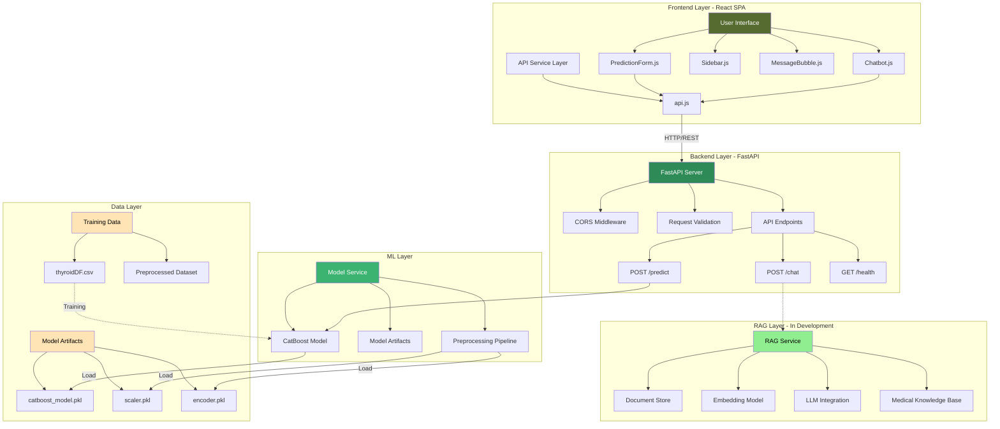
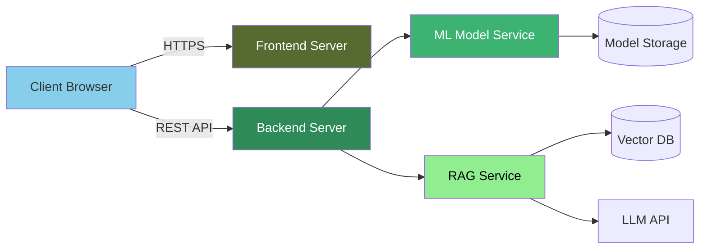

# ThyroRAG - System Architecture

## 📐 Architecture Diagram

## 🏗️ System Components

### 1. Frontend Layer (React)
**Technology Stack:** React.js, Axios, CSS3

**Components:**
- **PredictionForm.js** - Thyroid disease prediction interface
  - Collects patient data (age, sex, hormone levels)
  - Displays prediction results with confidence scores
  - Color-coded results (Hyperthyroid/Hypothyroid/Negative)
  
- **Chatbot.js** - RAG-powered medical assistant (In Development)
  - ChatGPT-style interface
  - Context-aware medical Q&A
  - Suggested questions and chat history
  
- **Sidebar.js** - Navigation and app switching
  - Tab switching between Prediction and Chatbot
  - Collapsible menu
  
- **MessageBubble.js** - Chat message rendering
  - User/AI message differentiation
  - Timestamps and avatars

**Services:**
- **api.js** - Centralized API client
  - HTTP request handling
  - Error management
  - Timeout configuration (30s)

### 2. Backend Layer (FastAPI)
**Technology Stack:** FastAPI, Python 3.x, Pydantic

**Endpoints:**
- `POST /predict` - Thyroid disease prediction
  - Input: Patient medical data (23 features)
  - Output: Prediction class, confidence, probabilities
  
- `POST /chat` - RAG chatbot query (Planned)
  - Input: User question
  - Output: AI-generated response with context
  
- `GET /health` - Health check endpoint
  - Output: API status

**Middleware:**
- CORS configuration for cross-origin requests
- Request validation with Pydantic models
- Error handling and logging

### 3. ML Layer
**Technology Stack:** CatBoost, Scikit-learn, NumPy, Pandas

**Components:**
- **CatBoost Classifier** - Gradient boosting model
  - Binary/Multi-class classification
  - Feature importance tracking
  - Model versioning
  
- **Preprocessing Pipeline**
  - StandardScaler for numerical features
  - LabelEncoder for categorical features
  - Feature engineering

**Model Artifacts:**
- `catboost_model.pkl` - Trained model
- `scaler.pkl` - Feature scaler
- `encoder.pkl` - Label encoder

### 4. RAG Layer (In Development)
**Planned Technology:** LangChain, OpenAI/Hugging Face, Vector DB

**Components:**
- **Document Store** - Medical knowledge repository
- **Embedding Model** - Text vectorization
- **LLM Integration** - GPT/Claude/Llama
- **Retrieval System** - Context-aware document retrieval

### 5. Data Layer
**Data Sources:**
- **thyroidDF.csv** - Training dataset
  - 3,772 patient records
  - 23 features (demographics, symptoms, lab results)
  - Target: Thyroid diagnosis

**Features:**
- Demographics: Age, Sex
- Medications: Thyroxine, Antithyroid
- Symptoms: Sick, Pregnant, Goitre, Tumor
- Lab Results: TSH, T3, TT4, T4U, FTI, TBG
- Medical History: Surgery, I131 treatment, Psychiatric

## 🔄 Data Flow

### Prediction Flow:
1. User enters medical data in PredictionForm
2. Frontend validates and formats data
3. api.js sends POST request to `/predict`
4. FastAPI validates request with Pydantic model
5. Backend preprocesses features (scaling, encoding)
6. CatBoost model generates prediction
7. Results (class, confidence, probabilities) returned to frontend
8. PredictionForm displays color-coded results

### Chat Flow (Planned):
1. User types question in Chatbot
2. Frontend sends POST request to `/chat`
3. RAG service retrieves relevant documents
4. LLM generates context-aware response
5. Response streamed back to frontend
6. MessageBubble displays AI response

## 🔒 Security & Configuration

- **CORS:** Configured for cross-origin requests
- **Input Validation:** Pydantic schemas enforce data types
- **Error Handling:** Graceful error messages to users
- **API Timeout:** 30-second timeout for requests
- **Environment Variables:** Configurable base URLs

## 📊 Model Information

**Training:**
- Algorithm: CatBoost Classifier
- Training logs: `backend/catboost_info/`
- Metrics: Accuracy, Precision, Recall, F1-Score

**Performance:**
- Training metrics logged in `learn_error.tsv`
- TensorBoard events in `events.out.tfevents`

## 🎨 UI/UX Design

**Theme:** Medical Professional
- Primary Color: #556B2F (Olive Green)
- Accent: White, Light Gray
- Typography: Clean, readable fonts
- Responsive: Desktop, Tablet, Mobile

**Features:**
- Smooth animations
- Loading states
- Error boundaries
- Accessibility considerations

## 🚀 Deployment Architecture

## 📝 Technology Summary

| Layer | Technologies |
|-------|-------------|
| Frontend | React.js, Axios, CSS3, JavaScript ES6+ |
| Backend | FastAPI, Python 3.x, Pydantic, Uvicorn |
| ML/AI | CatBoost, Scikit-learn, NumPy, Pandas |
| RAG | LangChain, Vector DB, LLM (Planned) |
| Data | CSV, Joblib (Model Persistence) |
| DevOps | npm, pip, Git, PowerShell |

## 🔮 Future Enhancements

1. **RAG Chatbot Implementation**
   - Integrate LangChain for document retrieval
   - Connect to medical knowledge bases
   - Add conversation history

2. **Advanced Features**
   - User authentication
   - Medical history storage
   - PDF report generation
   - Multi-language support

3. **Model Improvements**
   - Continuous retraining pipeline
   - A/B testing framework
   - Model explainability (SHAP values)

4. **Infrastructure**
   - Containerization (Docker)
   - Cloud deployment (AWS/Azure/GCP)
   - CI/CD pipeline
   - Monitoring and logging

---

**Last Updated:** January 22, 2026  
**Version:** 1.0.0  
**Status:** Prediction Module Complete, RAG Module In Development
